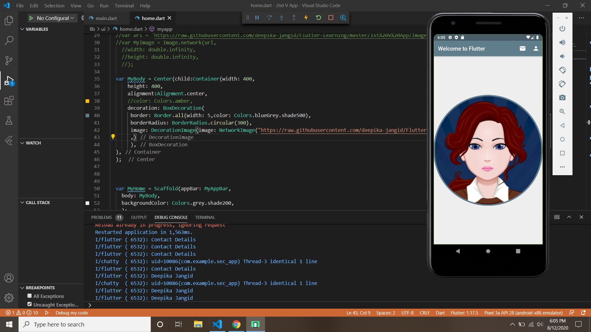

This app is similar in looks to <a href="https://github.com/deepika-jangid/Flutter-Learning/tree/master/1st%20V%20App">1st V App</a> but the functions used here are totally different from <b>1st V App</b>. So go through the code <a href="https://github.com/deepika-jangid/Flutter-Learning/blob/master/1st%20V%20App/lib/ui/home.dart">here</a> to feel and understand the difference between both.

