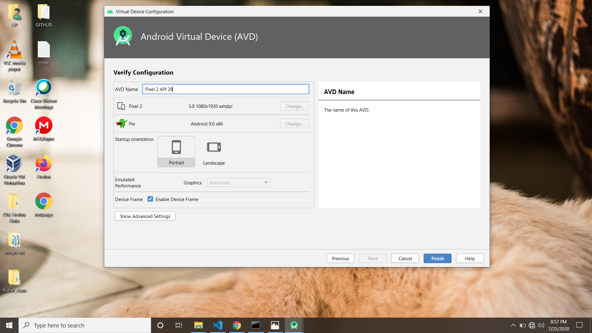
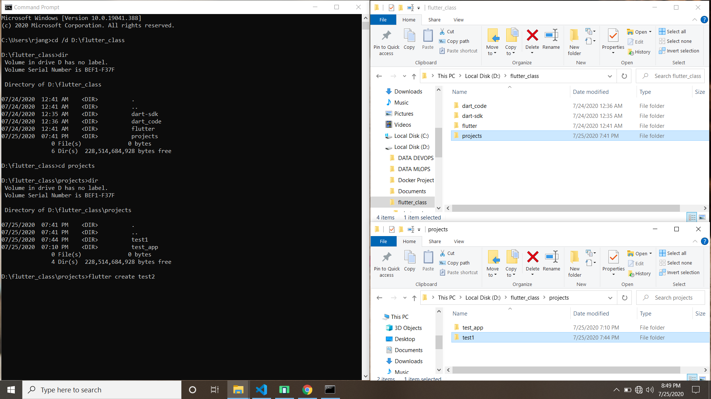
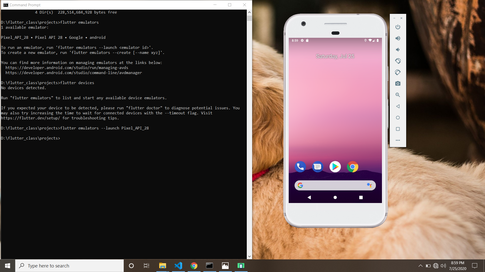
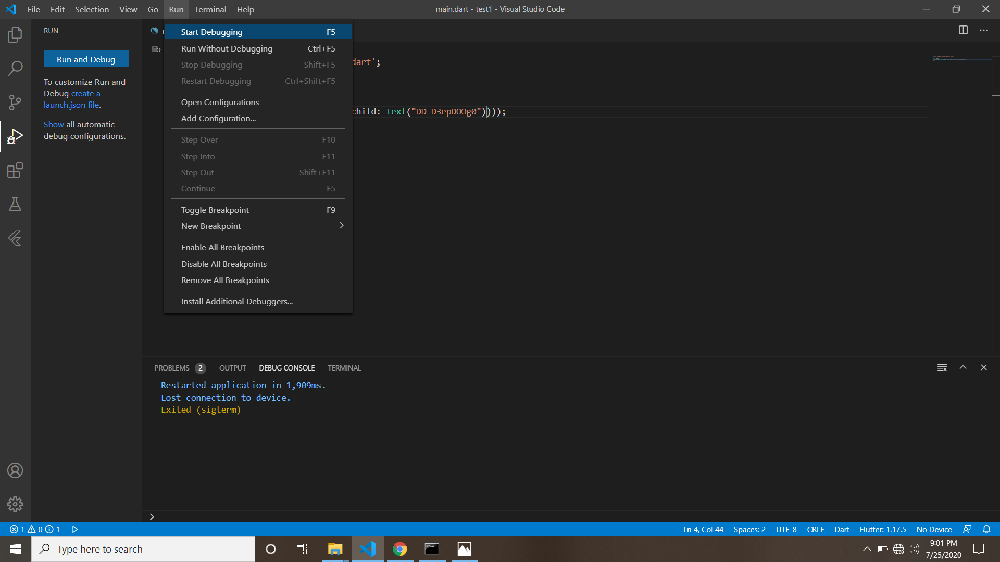

# HELLO WORLD PROJECT 
  Hello Geeks!! 
   This is my first flutter project which is a very basic flutter project just like the "Hello World" code we write in every programming language.  Here I will explain you             everything from basic to detail about how you can create this small app, how to build emulator, how to launch emulator, how to run app, etc. 
                       So let's start our journey of learning flutter from basic to advanced, starting from 
                       
# "How to build an Android Virtual Device(AVD) using Android Studio?"
                                
                                
  For building emulator using Android Studio, 
    1. You need to install Android Studio in your system.
    2. After installing Android Studio, Go to the Windows--->Android Studio--->Click Open
    3. Goto Configure--->AVD Manager--->Create Virtual Device--->Choose Phone and select whatever resources you need for your emulator.
    4. Click next,next,next and finish.
  
     
   
   
   After clicking on finish button, this will take some while to process your AVD so wait for some time till that have some tea and snacks. After it finishes, your emulator will    be visible in the emulators list. So congrats you now builded your own emulator successfully. 
      
   # "How to create app?"
   
   1. Through the command prompt, Goto the path where your flutter is installed. 
   2. Make a dir over there using command 'mkdir' and give any name like 'mkdir Name of your Dir'.
   3. Go within that dir by typing command 'cd Name of the Dir'.
   4. Write over there flutter create 'Any name you want to give to your app' ex- flutter create test1
   
   
   
   Now, Open the app file that you created from VSCode by going to OpenFolder/Dir--->App--->lib--->main.dart
   Write the code as follows in main.dart-
    
    import 'package:flutter/material.dart';

    void main() {
    runApp(MaterialApp(home:Center(child: Text("DD-D3epDOOg0"))));
    }
    
    
   Now you can launch the emulator that you build in two ways-
   1. From command line by typing the command 'flutter emulators --launch "Name of your Emulator" '
   
   
   
   
   2. From VS Code, after writting the code for app, save the code and goto RUN--->Start Debugging
   
   
   
   <b>Note</b>- For running the app, It is must to build the emulator and launch it because emulator is the device on which your app will gonna run. 
   
   <b>Now you will see the output as follows</b>-
   
  
  
  
  
  
  
      
