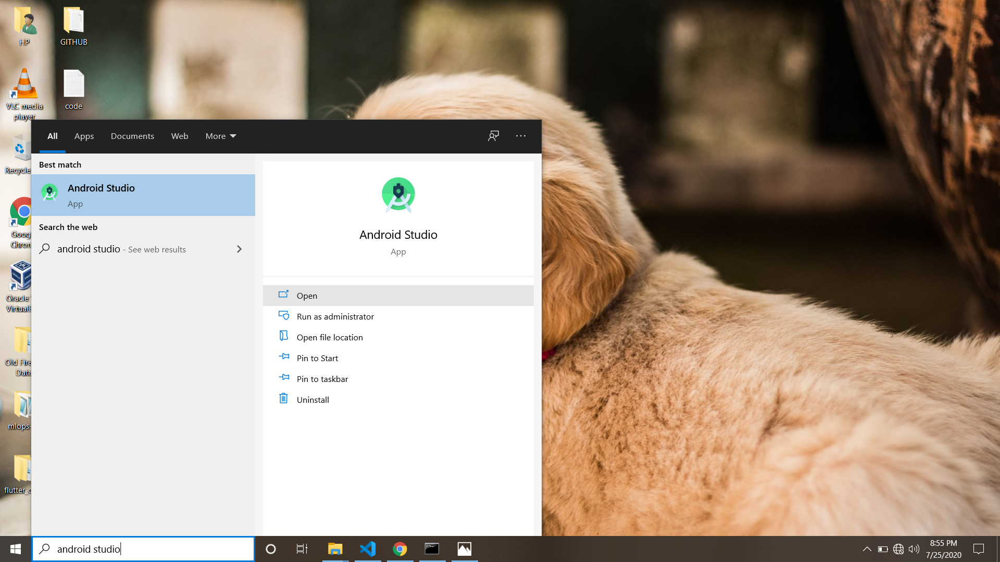
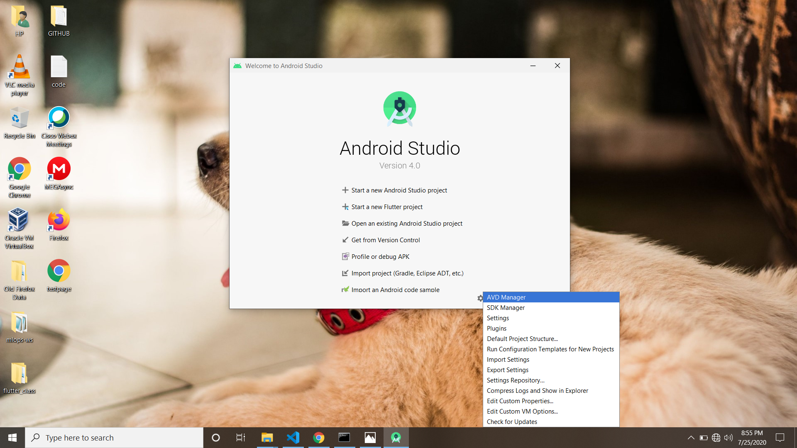
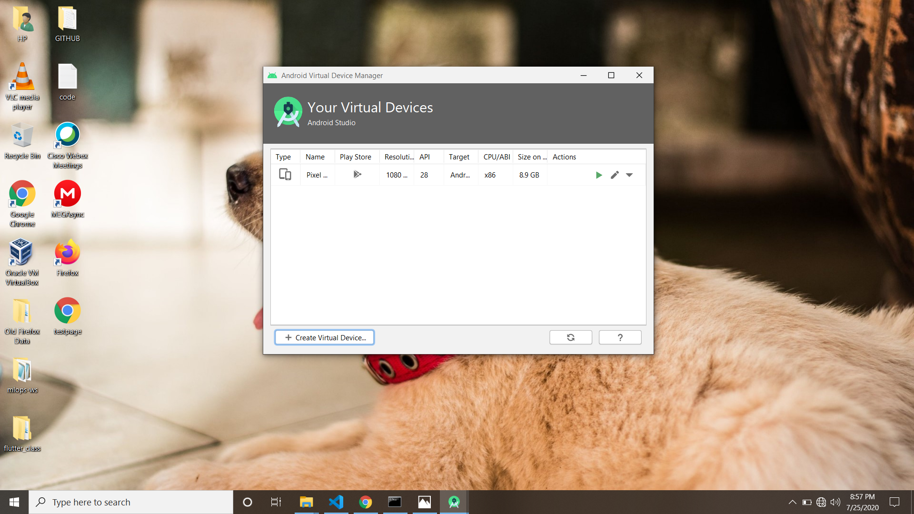
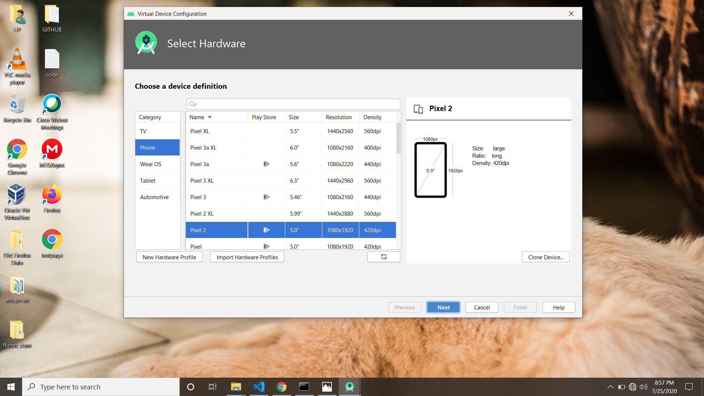
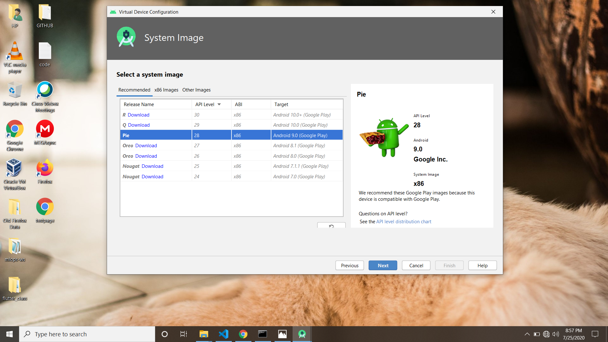

# HELLO WORLD PROJECT 
  Hello Geeks!! 
   This is my first flutter project which is a very basic flutter project just like the "Hello World" code we write in every programming language.  Here I will explain you             everything from basic to detail about how you can create this small app, how to build emulator, how to launch emulator, how to run app, etc. 
                       So let's start our journey of learning flutter from basic to advanced, starting from 
                       
                               "How to build an emulator/Android Virtual Device(AVD) using Android Studio."
                                
                                
  For building emulator using Android Studio, 
    1. You need to install Android Studio in your system.
    2. After installing Android Studio, Go to the Windows--->Android Studio--->Click Open
  
  
   
  
  
   
  
  
   
   
    
   
  
  
   
    
    
   
   
   After clicking on finish button, this will take some while to process your AVD so wait for some time till that have some tea and snacks. After it finishes, your emulator will    be visible in the emulators list. 
     So congrats you now builded your own emulator successfully. 
  
  
  
  
      
