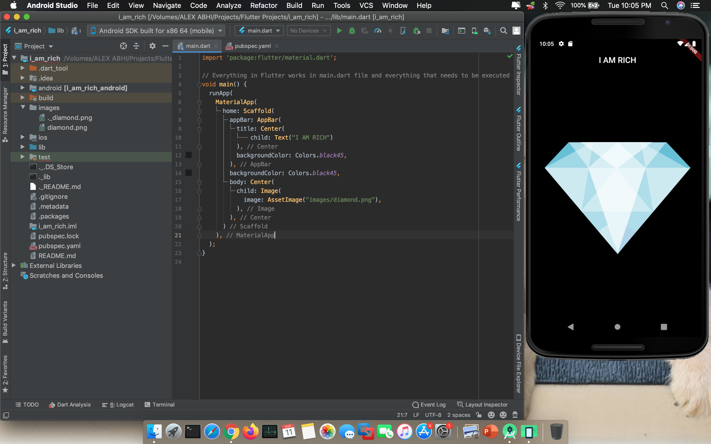

# I AM RICH
This is very basic app for beginners but interesting. There's a real incident behind <b>I AM RICH</b> app. An app was created by one of the guy named <b>Armin Heinrich</b> and was published in App Store many years ago and the cost of that app was $1,187. The fun thing is that the app does't have anything in it. When you open the app it just shows a picture of ruby and nothing else. So in this directory we have created something similar to that which every beginner should check-out once. It really interesting.  

  
So, above you can see the screen shot of code with the image and directory tree as well. Now just go ahead and give a try of your own and try to create an app which will named as i_am_poor. The app will be same as the i_am_rich but you just need to true for yourself and create your own app. It will help you to apply your own ideas and practise whatever you have leanred form i_am_rich app. Here's a sample screen-shot of the app.

